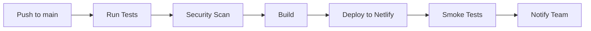

# Deployment Guide

## Overview

ComplianceFlow uses automated CI/CD pipelines for seamless deployment to production and staging environments.

## Environments

### Production
- **URL**: https://complianceflow.netlify.app
- **Branch**: `main`
- **Auto-deploy**: Yes (on push to main)
- **Manual deploy**: Available via GitHub Actions

### Staging
- **URL**: https://staging.complianceflow.netlify.app
- **Branch**: `develop`
- **Auto-deploy**: Yes (on push to develop)

## Deployment Process

### Automatic Deployment

1. **Push to main branch**:
   ```bash
   git checkout main
   git merge develop
   git push origin main
   ```

2. **GitHub Actions automatically**:
   - Runs all tests
   - Performs security scans
   - Builds the application
   - Deploys to Netlify
   - Creates a GitHub release (if tagged)

### Manual Deployment

1. Go to [GitHub Actions](https://github.com/juankaspain/complianceflow.es/actions)
2. Select "Deploy to Production" workflow
3. Click "Run workflow"
4. Choose environment (production/staging)
5. Click "Run workflow" button

### Release Tagging

For versioned releases:

```bash
# Create and push a version tag
git tag -a v2.1.0 -m "Release version 2.1.0"
git push origin v2.1.0
```

This will:
- Trigger production deployment
- Create a GitHub release
- Generate release notes

## Pre-deployment Checklist

- [ ] All tests passing
- [ ] Security scans completed
- [ ] Environment variables configured
- [ ] Database migrations ready (if any)
- [ ] Rollback plan prepared
- [ ] Stakeholders notified

## Environment Variables

Required secrets in GitHub:

```
NETLIFY_SITE_ID          # Netlify site ID
NETLIFY_AUTH_TOKEN       # Netlify authentication token
NEXT_PUBLIC_SITE_URL     # Production site URL
NEXT_PUBLIC_API_URL      # API endpoint URL
NEXT_PUBLIC_POSTHOG_KEY  # PostHog analytics key
CODECOV_TOKEN           # CodeCov token (optional)
LHCI_GITHUB_APP_TOKEN   # Lighthouse CI token (optional)
```

### Setting Secrets

1. Go to repository Settings
2. Navigate to Secrets and variables > Actions
3. Click "New repository secret"
4. Add each required secret

## Monitoring

### After Deployment

1. **Check deployment status**:
   - GitHub Actions logs
   - Netlify deployment dashboard

2. **Verify site is live**:
   ```bash
   curl -I https://complianceflow.netlify.app
   ```

3. **Monitor errors**:
   - Check error tracking (Sentry/LogRocket)
   - Review server logs
   - Check analytics for anomalies

4. **Performance check**:
   - Run Lighthouse audit
   - Check Web Vitals metrics
   - Monitor load times

## Rollback Procedure

### Quick Rollback (Netlify)

1. Go to Netlify dashboard
2. Select "Deploys" tab
3. Find last working deployment
4. Click "Publish deploy"

### Git Rollback

```bash
# Revert last commit
git revert HEAD
git push origin main

# Or reset to previous commit
git reset --hard <commit-hash>
git push --force origin main
```

⚠️ **Warning**: Force push should be used carefully

## Troubleshooting

### Build Fails

1. Check GitHub Actions logs
2. Verify all dependencies are installed
3. Check for TypeScript errors
4. Ensure environment variables are set

### Deployment Succeeds but Site Down

1. Check Netlify logs
2. Verify DNS settings
3. Check for runtime errors in browser console
4. Review CSP headers

### Performance Issues

1. Check bundle size
2. Verify caching is working
3. Review database queries
4. Check API response times

## Best Practices

1. **Always deploy during low-traffic periods**
2. **Test thoroughly in staging first**
3. **Keep deployment logs**
4. **Monitor for at least 1 hour after deployment**
5. **Have rollback plan ready**
6. **Communicate with team**
7. **Document any issues**

## CI/CD Pipeline



## Support

For deployment issues:
- Check GitHub Issues
- Contact DevOps team
- Review Netlify documentation
- Consult deployment logs